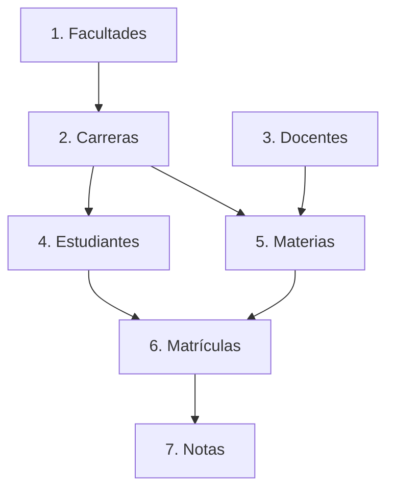

# 📱 Admisión de Instituto Educativo (Movil_Gestion_MA)
### Cliente Móvil Android de Gestión Académica y Matrículas

---

## 📄 Descripción General

**Admisión de Instituto Educativo** es una aplicación móvil nativa para Android desarrollada en **Kotlin** y construida con **Jetpack Compose**. Su propósito principal es ofrecer una solución integral para el control de admisiones, administración de matrículas, asignación de asignaturas y registro de calificaciones en una institución de educación superior.

El sistema funciona como un cliente móvil que consume de forma segura una API REST externa desarrollada en **Django REST Framework** y respaldada por una base de datos relacional **PostgreSQL**, ambos alojados en un servidor de producción.

La aplicación destaca por incorporar un control estricto de acceso basado en tokens de seguridad **JWT**, permitiendo diferenciar de manera inteligente las funcionalidades visibles según el rol del usuario (Administrador con permisos de escritura completa vs. Usuario estándar con permisos de consulta).

---

## 🛠️ Arquitectura y Tecnologías Clave

La ingeniería de software aplicada en este proyecto se basa en los estándares recomendados por Google para el desarrollo Android moderno:

* **Arquitectura Limpia & MVVM**: Separación estricta de responsabilidades en capas claras:
  - **Datos (Data Layer)**: Manejo de red mediante Retrofit, interceptores HTTP, y persistencia local de preferencias.
  - **Dominio (Domain Layer/Models)**: Representación pura del negocio y validación de datos.
  - **Presentación (Presentation Layer)**: Vistas reactivas construidas en Compose coordinadas por ViewModels que retienen y exponen estados inmutables.
* **UI Declarativa**: Toda la interfaz visual ha sido diseñada desde cero usando **Jetpack Compose** y **Material Design 3**, asegurando una experiencia de usuario (UX) fluida, moderna y responsiva.
* **Inyección de Dependencias**: Implementación de **Dagger Hilt** para garantizar la modularidad del código, desacoplamiento y facilitar las pruebas unitarias.
* **Programación Asíncrona**: Uso de **Kotlin Coroutines** y reactividad con **StateFlow** para realizar operaciones en segundo plano sin congelar el hilo principal de la interfaz.
* **Persistencia Segura**: Uso de **DataStore Preferences** para guardar de manera asíncrona y segura la sesión del usuario (Access & Refresh Tokens).

---

## ⚙️ Requisitos del Entorno

### Requisitos de Desarrollo
Para compilar, depurar y ejecutar la aplicación desde su código fuente, asegúrese de contar con:
* **Entorno Integrado**: Android Studio Hedgehog.
* **Kit de Desarrollo**: Java Development Kit (JDK).
* **SDK de Android**: Versión mínima de SDK compatible (Min SDK) **API 26 (Android 8.0)**, y SDK objetivo (Target SDK) **API 34**.
* **Gestor de Dependencias**: Gradle compatible con Kotlin DSL (`build.gradle.kts`).

### Requisitos del Dispositivo de Pruebas
* **Dispositivo Físico o Virtual (AVD)** con Android 8.0 o superior.
* **Acceso a Red**: Conexión activa a Internet para consumir la API de producción, o estar conectado a la misma red local del servidor de desarrollo.

---

## 🌐 Configuración de la Red y URL del Servidor

La comunicación con el backend está centralizada en el módulo de inyección de dependencias de red. Para alternar entre el servidor de pruebas en producción y un entorno de desarrollo local, modifique la constante `BASE_URL` en el archivo:

📂 `GestionEducativaMovil/app/src/main/java/com/gestion/educativa/di/AppModule.kt`

```kotlin
// =========================================================================
// CONFIGURACIÓN DE APUNTAMIENTO DE RED
// =========================================================================

// Opción A: Servidor de Producción (Configuración por defecto para Alex Macias)
private const val BASE_URL = "http://macias-admisiones.uaeftt-ute.site/api/"

// Opción B: Entorno de Desarrollo Local (Conexión desde Emulador AVD)
// private const val BASE_URL = "http://10.0.2.2:8000/api/"
```

> [!TIP]
> La dirección IP `10.0.2.2` es un alias especial utilizado por el emulador de Android Studio para comunicarse de manera transparente con el puerto `localhost` (`127.0.0.1`) de la máquina donde se ejecuta el backend.

---

## 🔑 Credenciales de Acceso y Gestión de Roles

El acceso a la información y las acciones dentro de la aplicación están controlados por un sistema de permisos basado en el campo `is_staff` codificado dentro del token JWT:

### 1. Perfil Administrador (Acciones de Escritura y Modificación)
* **Usuario**: `admin`
* **Contraseña**: `admin`
* **Permisos**: Crear nuevas facultades/carreras, matricular estudiantes, registrar notas, modificar datos existentes y eliminar registros.
* **Condición de Rol**: `is_staff = true` en la base de datos del backend.

### 2. Perfil Estándar (Acciones de Consulta)
* **Usuario**: `usuario1`
* **Contraseña**: `usuario1`
* **Permisos**: Visualización de listas académicas y consulta de detalles en modo solo lectura. No tiene permisos de creación, edición ni borrado.
* **Condición de Rol**: `is_staff = false`.

> [!IMPORTANT]
> El rol y el nombre de usuario se determinan en tiempo de ejecución decodificando el Payload del JWT utilizando la clase utilitaria [JwtUtils.kt](file:///c:/Users/Usuario/Desktop/Movil_Gestion_MA/GestionEducativaMovil/app/src/main/java/com/gestion/educativa/utils/JwtUtils.kt).
>
> Los usuarios se pueden administrar, crear o modificar a través de los paneles administrativos de Django Admin:
> * **Panel de Producción (Dominio)**: [https://macias-admisiones.uaeftt-ute.site/admin](https://macias-admisiones.uaeftt-ute.site/admin)
> * **Panel de Producción (IP)**: [http://143.244.157.1/admin/](http://143.244.157.1/admin/)
> * **Panel de Desarrollo Local**: `http://localhost:8000/admin/`

---

## 🗂️ Módulos y Entidades del Negocio

La aplicación realiza operaciones de lectura, escritura, actualización y eliminación (CRUD) para las siguientes **7 entidades** académicas principales:



### 🏫 1. Facultades (`/api/facultades/`)
Representa las divisiones académicas estructurales del instituto.
* **Campos principales**: Nombre oficial de la facultad, Código identificador único, Descripción institucional, Estado (Activo/Inactivo).
* **Filtros**: Permite búsquedas por nombre y código de facultad.

### 🎓 2. Carreras (`/api/carreras/`)
Los distintos programas de estudio que imparte cada facultad.
* **Campos principales**: Nombre del programa, Código curricular, Relación a la Facultad responsable (FK), Duración del plan de estudios en semestres, Estado.
* **Filtros**: Búsqueda por texto y agrupamiento por facultad.

### 💼 3. Docentes (`/api/docentes/`)
Registro formal de la plantilla docente del instituto.
* **Campos principales**: Vinculación al usuario del sistema (FK), Número de Cédula/DNI, Teléfono de contacto, Especialidad académica principal, Estado de contratación.

### 👤 4. Estudiantes (`/api/estudiantes/`)
Base de datos de los alumnos inscritos en los distintos programas.
* **Campos principales**: Vinculación al usuario del sistema (FK), Carrera en la que está inscrito (FK), Cédula/DNI, Teléfono, Semestre actual cursado, Estado de permanencia.

### 📚 5. Materias (`/api/materias/`)
Asignaturas individuales que componen las mallas curriculares.
* **Campos principales**: Nombre de la materia, Código de asignatura, Carrera de pertenencia (FK), Docente asignado (FK), Número de créditos, Nivel/Semestre asignado, Estado.

### ✍️ 6. Matrículas (`/api/matriculas/`)
La formalización del estudiante cursando una asignatura específica.
* **Campos principales**: Estudiante inscrito (FK), Materia asociada (FK), Período académico (ej. 2026-I), Estado de la matrícula (Activa, Retirada, Finalizada), Fecha de registro.

### 📊 7. Notas (`/api/notas/`)
Seguimiento cualitativo y cuantitativo del rendimiento de los estudiantes.
* **Campos principales**: Matrícula asociada (FK), Calificación Parcial 1, Calificación Parcial 2, Nota Examen Final.
* **Cálculo Automático**: La Nota Final y la condición de "Aprobado/Reprobado" se calculan y validan directamente en el servidor backend al persistirse las calificaciones.

---

## 🗺️ Mapa de Navegación y Rutas Compose

La navegación de la aplicación está descentralizada a través de Compose Navigation. Contiene un flujo estructurado con **24 vistas clave**:

| Módulo / Flujo | Tipo de Pantalla | Ruta en el Código | Funcionalidad |
|---|---|---|---|
| **Acceso** | Inicio de Sesión | `login` | Autenticación con credenciales JWT |
| | Registro de Cuenta | `register` | Creación de cuenta de usuario básico |
| | Verificación | `verification` | Proceso de validación de credenciales |
| **Inicio** | Dashboard Principal | `home` | Panel con accesos directos a los 7 módulos |
| **Facultades** | Listado | `facultad_list` | Búsqueda, paginación y visualización |
| | Detalle | `facultad_detail/{id}` | Ficha de información de la facultad |
| | Formulario | `facultad_form?id={id}` | Creación o edición de facultades (Admin) |
| **Carreras** | Listado | `carrera_list` | Consulta y agrupamiento por facultad |
| | Detalle | `carrera_detail/{id}` | Ficha técnica de la carrera |
| | Formulario | `carrera_form?id={id}` | Creación o modificación de carreras |
| **Docentes** | Listado | `docente_list` | Visualización del personal docente activo |
| | Detalle | `docente_detail/{id}` | Historial y especialidad del profesor |
| | Formulario | `docente_form?id={id}` | Formulario de registro de docentes |
| **Estudiantes** | Listado | `estudiante_list` | Padrón de alumnos inscritos en el sistema |
| | Detalle | `estudiante_detail/{id}` | Perfil académico del estudiante |
| | Formulario | `estudiante_form?id={id}` | Registro y actualización del estudiante |
| **Materias** | Listado | `materia_list` | Malla curricular con filtros de búsqueda |
| | Detalle | `materia_detail/{id}` | Datos informativos de la asignatura |
| | Formulario | `materia_form?id={id}` | Asignación y registro de materias |
| **Matrículas** | Listado | `matricula_list` | Control de estudiantes matriculados |
| | Detalle | `matricula_detail/{id}` | Consulta del registro de inscripción |
| | Formulario | `matricula_form?id={id}` | Inscripción a materias por periodo |
| **Notas** | Listado | `nota_list` | Consulta general de calificaciones |
| | Detalle | `nota_detail/{id}` | Boletín de calificaciones del alumno |
| | Formulario | `nota_form?id={id}` | Carga y edición de calificaciones (Admin) |

---

## 🔌 Consumo de Servicios REST (Ejemplos HTTP)

### Autenticación e Intercambio de Tokens (POST)
El cliente inicia sesión enviando credenciales limpias y recibe el par de tokens de seguridad para firmar las siguientes peticiones:

```http
POST http://macias-admisiones.uaeftt-ute.site/api/auth/login/
Content-Type: application/json

{
  "username": "admin",
  "password": "admin"
}
```

*Respuesta exitosa (HTTP 200 Ok):*
```json
{
  "access": "eyJhbGciOiJIUzI1NiIsInR5cCI6IkpXVCJ9.eyJ1c2VyX2lkIjoxLCJpcy1zdGFmZiI6dHJ1ZX0...",
  "refresh": "eyJhbGciOiJIUzI1NiIsInR5cCI6IkpXVCJ9.eyJ1c2VyX2lkIjoxLCJ0b2tlbi1yZWZyZXNoIn0..."
}
```

### Obtención Paginada y Filtrada (GET)
Los listados consumen los endpoints incluyendo parámetros de página y búsqueda, inyectando el token Bearer en el interceptor:

```http
GET http://macias-admisiones.uaeftt-ute.site/api/carreras/?page=1&search=Sistemas
Authorization: Bearer <access_token>
```

### Envío de Nuevos Registros (POST)
```http
POST http://macias-admisiones.uaeftt-ute.site/api/carreras/
Authorization: Bearer <access_token>
Content-Type: application/json

{
  "facultad": 1,
  "nombre": "Ingeniería de Software",
  "codigo": "IS-SOFTWARE-01",
  "duracion_semestres": 9,
  "activo": true
}
```

---

## 🛠️ Estructura del Código Fuente del Cliente

El código fuente en Android sigue un ordenamiento semántico estricto para facilitar el mantenimiento y la escalabilidad del proyecto:

```
GestionEducativaMovil/app/src/main/java/com/gestion/educativa/
│
├── 🚀 GestionEducativaApp.kt        # Inicializador global (Configuración Hilt)
├── 🖥️ MainActivity.kt               # Contenedor de la UI y controlador de ciclo de vida
├── 🔒 VerificationScreen.kt          # Módulo de control de acceso y verificación
│
├── 📁 data/                        # CAPA DE DATOS
│   ├── 📁 api/
│   │   ├── ApiService.kt           # Definición de peticiones HTTP con Retrofit
│   │   ├── AuthInterceptor.kt      # Inyección dinámica de Bearer Tokens en headers
│   │   └── TokenManager.kt         # Gestión e intercambio en memoria del token JWT
│   ├── 📁 model/
│   │   └── Models.kt               # Clases de datos y esquemas JSON (DTOs)
│   ├── 📁 preferences/
│   │   └── UserPreferences.kt      # Manejador de persistencia segura local (DataStore)
│   └── 📁 repository/              # Acceso unificado a los orígenes de datos locales/remotos
│
├── 📁 di/                          # CAPA DE INYECCIÓN DE DEPENDENCIAS
│   └── AppModule.kt                # Módulo Hilt para creación de Clientes HTTP, Retrofit y Repositorios
│
├── 📁 utils/                       # UTILERÍAS COMPARTIDAS
│   ├── ErrorHandler.kt             # Manejador genérico de excepciones de red y códigos HTTP
│   ├── JwtUtils.kt                 # Parser local de Payloads JWT (Extracción de roles)
│   └── Resource.kt                 # Tipo genérico sellado para gestión de estados (Loading, Success, Error)
│
└── 📁 ui/                          # CAPA DE PRESENTACIÓN (VISTAS Y LOGICA DE INTERFAZ)
    ├── 📁 theme/                   # Paleta de colores, tipografía y estilo visual de Material 3
    ├── 📁 navigation/              # Configuración de rutas (Screen) y grafo Compose (NavGraph)
    ├── 📁 components/
    │   └── CommonComponents.kt     # Widgets reutilizables (Botones, Cajas de texto, Alertas)
    ├── 📁 auth/                    # Lógica y vistas de Login/Registro de usuarios
    ├── 📁 home/
    │   └── HomeScreen.kt           # Dashboard principal con grilla interactiva
    └── 📁 (entidades)/             # Paquetes CRUD específicos por cada entidad (Ej: facultad, carrera, nota...)
```

---

## ⚙️ Compilación e Instalación

### Compilación por Consola (Gradle Wrapper)
Para compilar la aplicación y generar el archivo APK ejecutable de depuración, ejecute la siguiente instrucción desde la consola de comandos en la raíz de `GestionEducativaMovil/`:

```powershell
./gradlew assembleDebug
```

Al completarse el build, encontrará el archivo instalable en:
`GestionEducativaMovil/app/build/outputs/apk/debug/app-debug.apk`

---

## 🔒 Nota de Configuración Backend (Generación de Claims Personalizados)

Para garantizar la correcta distinción de roles dentro de la interfaz móvil, el backend Django debe inyectar el parámetro `is_staff` en la firma de sus tokens JWT.

Asegúrese de contar con la siguiente lógica en el backend (ejemplo usando la librería `django-rest-framework-simplejwt`):

```python
# En el archivo serializers.py o views.py de autenticación de tu backend Django:
from rest_framework_simplejwt.serializers import TokenObtainPairSerializer

class CustomTokenObtainPairSerializer(TokenObtainPairSerializer):
    @classmethod
    def get_token(cls, user):
        # Generamos el token por defecto
        token = super().get_token(user)
        
        # Agregamos los claims personalizados requeridos por el cliente Android
        token['is_staff'] = user.is_staff
        token['username'] = user.username
        
        return token
```
