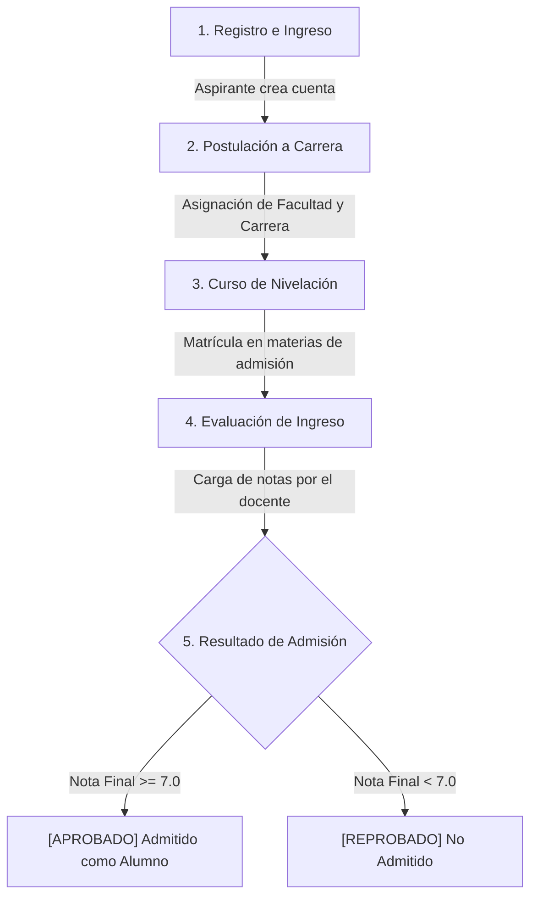

# 🎓 Admisión de Instituto Educativo
### Cliente Móvil Android para la Gestión de Admisiones y Nivelación Académica

---

## 📄 Descripción del Sistema

**Admisión de Instituto Educativo** es una aplicación móvil nativa para Android diseñada específicamente para automatizar, controlar y evaluar el **Proceso de Admisiones y Nivelación Académica** de aspirantes a educación superior.

A través de una interfaz ágil construida en **Jetpack Compose** y una arquitectura estructurada en **MVVM**, el sistema permite realizar el acompañamiento completo del aspirante: desde su postulación inicial y registro de datos personales, hasta su asignación a cursos de nivelación y el resultado final de admisión (determinado por sus calificaciones de ingreso).

La aplicación consume una API REST segura en **Django REST Framework** conectada a una base de datos **PostgreSQL**, ambos alojados en producción.

---

## 🚀 Flujo del Proceso de Admisión en la App

El sistema está estructurado para guiar al aspirante y al administrador a través de las fases clave de admisión:



1. **Registro e Ingreso**: El postulante crea su cuenta en la app (`register`) e inicia sesión (`login`).
2. **Postulación**: Se registra la ficha del postulante (*Estudiante*) vinculándolo a la *Carrera* y *Facultad* a la que aspira ingresar.
3. **Periodo de Nivelación**: El postulante es matriculado (*Matrícula*) en los cursos propedéuticos y de admisión correspondientes a su área académica (*Materias* de nivelación).
4. **Evaluación**: Los docentes asignados califican el rendimiento del postulante (*Notas*).
5. **Veredicto**: El backend procesa las calificaciones de manera automática. Si el promedio cumple con la nota mínima requerida, el estado de la matrícula cambia a aprobado y se formaliza su admisión.

---

## 🗂️ Organización de Módulos y Entidades

Para mayor claridad, el sistema separa la información en dos grandes categorías de datos: **Estructura de Postulación** e **Instrumentación de Admisión**.

### 🏛️ A. Estructura de Postulación
Módulos que definen el destino académico del postulante:

* **🏫 1. Facultades (`/api/facultades/`)**
  Representa las áreas del conocimiento del instituto (ej. *Ingenierías, Ciencias de la Salud, Ciencias Sociales*).
* **🎓 2. Carreras (`/api/carreras/`)**
  Los planes de estudio ofertados que pertenecen a cada facultad (ej. *Ingeniería de Software, Ciberseguridad, Enfermería*).
* **👤 3. Estudiantes / Aspirantes (`/api/estudiantes/`)**
  El registro personal de los postulantes que solicitan admisión, vinculados a la carrera elegida y su semestre de ingreso.

---

### 📝 B. Instrumentación y Evaluación de Admisiones
Módulos encargados de calificar y regular el ingreso de los aspirantes:

* **💼 4. Docentes / Evaluadores (`/api/docentes/`)**
  El cuerpo docente encargado de impartir y evaluar los cursos obligatorios de admisión.
* **📚 5. Materias de Admisión (`/api/materias/`)**
  Asignaturas propedéuticas requeridas para nivelar a los postulantes (ej. *Curso de Nivelación en Programación, Matemáticas Elementales*).
* **✍️ 6. Matrículas de Admisión (`/api/matriculas/`)**
  La vinculación del aspirante a las materias de admisión en el periodo activo (ej. Periodo `2026-I`).
* **📊 7. Notas / Evaluación (`/api/notas/`)**
  Registro de calificaciones (Parcial 1, Parcial 2 y Examen Final). El veredicto de admisión (Aprobado/Reprobado) y la nota final son calculados automáticamente en el servidor para evitar fraudes.

---

## 🗺️ Mapa de Pantallas por Módulo

La navegación de la aplicación se organiza lógicamente en Compose Navigation según la fase del proceso en la que se encuentre el usuario:

### 🔐 1. Módulo de Acceso y Seguridad
* **Inicio de Sesión (`login`)**: Acceso seguro con credenciales JWT (diferencia botones de administrador y usuario estándar).
* **Registro de Cuenta (`register`)**: Creación de nuevas cuentas para aspirantes de forma autónoma.
* **Verificación (`verification`)**: Pantalla de validación de credenciales activas.
* **Dashboard Principal (`home`)**: Panel de control con acceso directo a la administración de admisiones y reportes.

### 🏢 2. Módulo de Gestión de Oferta Académica (CRUD completo)
* **Facultades**: Lista de facultades (`facultad_list`), Ficha detallada (`facultad_detail/{id}`) y Formulario de creación (`facultad_form?id={id}`).
* **Carreras**: Lista de carreras con filtros (`carrera_list`), Ficha detallada (`carrera_detail/{id}`) y Formulario de creación (`carrera_form?id={id}`).

### 👥 3. Módulo de Aspirantes y Docentes (CRUD completo)
* **Aspirantes**: Padrón de postulantes (`estudiante_list`), Perfil académico del aspirante (`estudiante_detail/{id}`) y Formulario de postulación (`estudiante_form?id={id}`).
* **Evaluadores**: Lista de docentes (`docente_list`), Especialidad del evaluador (`docente_detail/{id}`) y Formulario de registro (`docente_form?id={id}`).

### 📚 4. Módulo de Nivelación y Calificaciones (CRUD completo)
* **Materias**: Lista de materias de admisión (`materia_list`), Detalle de créditos (`materia_detail/{id}`) y Creación de cursos (`materia_form?id={id}`).
* **Matrículas**: Lista de inscripciones activas (`matricula_list`), Detalle de matrícula (`matricula_detail/{id}`) y Registro de matrículas (`matricula_form?id={id}`).
* **Calificaciones**: Lista de notas (`nota_list`), Boletín del aspirante (`nota_detail/{id}`) y Carga de calificaciones de ingreso (`nota_form?id={id}`).

---

## ⚙️ Configuración y Puntos de Conexión

### Dirección del Servidor de Admisiones
La comunicación está centralizada en el módulo Hilt del cliente Android:

📂 `GestionEducativaMovil/app/src/main/java/com/gestion/educativa/di/AppModule.kt`

```kotlin
// Servidor de Producción de Admisiones (Alex Macias)
private const val BASE_URL = "http://macias-admisiones.uaeftt-ute.site/api/"

// Servidor de Desarrollo Local (Conexión desde Emulador AVD)
// private const val BASE_URL = "http://10.0.2.2:8000/api/"
```

### Credenciales de Acceso
* **Administrador de Admisiones (Permisos de Escritura/Modificación)**:
  * **Usuario**: `admin` | **Contraseña**: `admin` | **Rol**: `is_staff = true`
* **Postulante / Usuario de Consulta (Solo Lectura)**:
  * **Usuario**: `usuario1` | **Contraseña**: `usuario1` | **Rol**: `is_staff = false`

> [!NOTE]
> Para la administración global de cuentas, los accesos directos al panel web de Django Admin son:
> * **Panel Web Principal**: [https://macias-admisiones.uaeftt-ute.site/admin](https://macias-admisiones.uaeftt-ute.site/admin)
> * **Panel Web Alternativo**: [http://143.244.157.1/admin/](http://143.244.157.1/admin/)

---

## 🔌 Ejemplos de Interacción con la API de Admisiones

### 1. Registro de un nuevo Aspirante (POST)
El aspirante se registra en el sistema de manera autónoma:
```http
POST http://macias-admisiones.uaeftt-ute.site/api/auth/register/
Content-Type: application/json

{
  "username": "alex_estudiante",
  "email": "alex.macias@estudiantes.edu.ec",
  "password": "User1234!",
  "first_name": "Alex",
  "last_name": "Macias"
}
```

### 2. Creación de Ficha de Admisión (POST)
El administrador vincula al usuario registrado con la carrera elegida:
```http
POST http://macias-admisiones.uaeftt-ute.site/api/estudiantes/
Authorization: Bearer <access_token>
Content-Type: application/json

{
  "user": 8,
  "carrera": 2,
  "cedula": "1711122233",
  "telefono": "0991112223",
  "semestre_actual": 1,
  "activo": true
}
```

### 3. Matrícula en Curso de Nivelación (POST)
```http
POST http://macias-admisiones.uaeftt-ute.site/api/matriculas/
Authorization: Bearer <access_token>
Content-Type: application/json

{
  "estudiante": 3,
  "materia": 4,
  "periodo": "2026-I",
  "estado": "activa",
  "fecha_matricula": "2026-06-07"
}
```

---

## 🛠️ Estructura del Proyecto Android

```
GestionEducativaMovil/app/src/main/java/com/gestion/educativa/
│
├── 🚀 GestionEducativaApp.kt        # Inicializador global (Configuración Hilt)
├── 🖥️ MainActivity.kt               # Contenedor de la UI y controlador de ciclo de vida
├── 🔒 VerificationScreen.kt          # Módulo de control de acceso y verificación
│
├── 📁 data/                        # CAPA DE DATOS (API REST, Interceptores, Repositorios)
│   ├── 📁 api/
│   │   ├── ApiService.kt           # Endpoints de Admisión con Retrofit
│   │   ├── AuthInterceptor.kt      # Inyección dinámica de Bearer Tokens en headers
│   │   └── TokenManager.kt         # Gestión del Token JWT en memoria
│   ├── 📁 model/
│   │   └── Models.kt               # DTOs y Modelos de datos del aspirante
│   ├── 📁 preferences/
│   │   └── UserPreferences.kt      # Persistencia de sesión segura (DataStore)
│   └── 📁 repository/              # Acceso unificado a datos locales y remotos
│
├── 📁 di/                          # CAPA DE INYECCIÓN DE DEPENDENCIAS
│   └── AppModule.kt                # Módulo Hilt para Retrofit y Repositorios
│
├── 📁 utils/                       # UTILERÍAS COMPARTIDAS
│   ├── ErrorHandler.kt             # Parsea excepciones HTTP en mensajes legibles
│   ├── JwtUtils.kt                 # Parser local de Payloads JWT (Extracción de roles)
│   └── Resource.kt                 # Sealed class genérica para manejar estados de la interfaz
│
└── 📁 ui/                          # CAPA DE PRESENTACIÓN (VISTAS EN JETPACK COMPOSE)
    ├── 📁 theme/                   # Tema visual de Material 3 (Colores, Tipografías)
    ├── 📁 navigation/              # Enrutador (Screen y NavGraph)
    ├── 📁 components/
    │   └── CommonComponents.kt     # Botones, campos de texto y diálogos de confirmación
    ├── 📁 auth/                    # Vistas de Login y Registro de aspirantes
    ├── 📁 home/
    │   └── HomeScreen.kt           # Dashboard interactivo con los módulos de admisión
    └── 📁 (entidades)/             # Pantallas y ViewModels por cada módulo (Facultades, Carreras, etc.)
```

---

## ⚙️ Compilación del APK

Para generar el instalable de pruebas desde la raíz de `GestionEducativaMovil/`:
```powershell
./gradlew assembleDebug
```
Ubicación del APK generado:
`GestionEducativaMovil/app/build/outputs/apk/debug/app-debug.apk`
